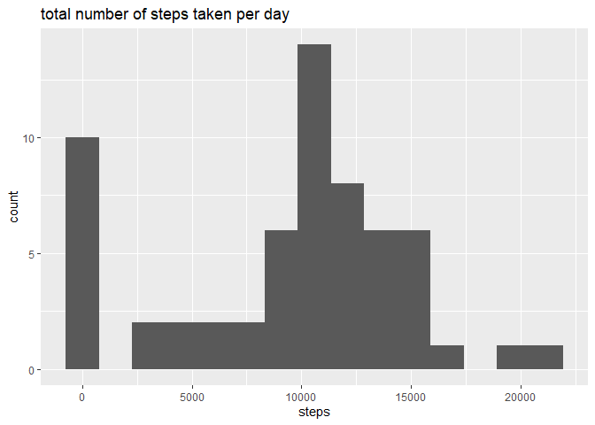
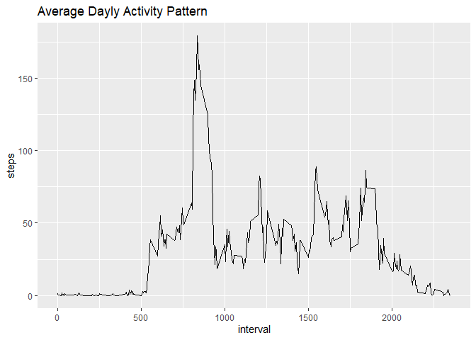
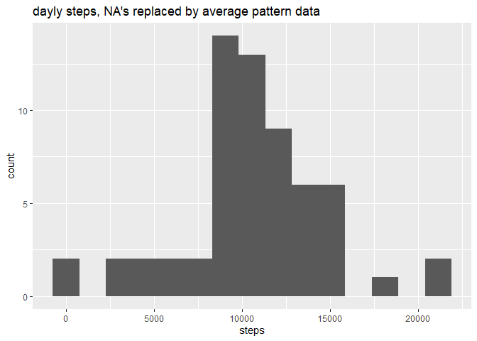
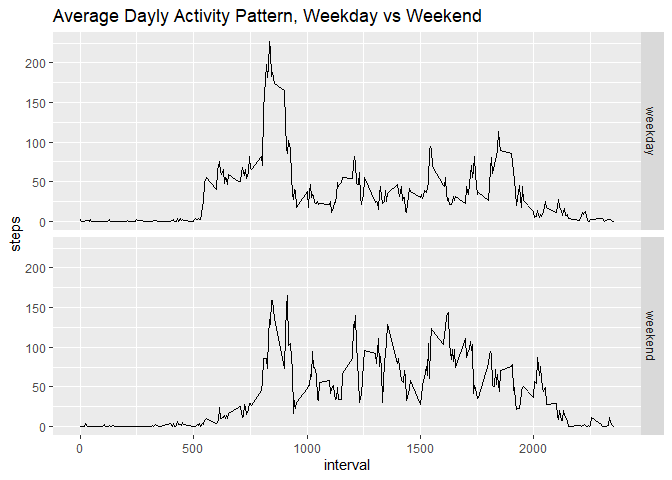

## Loading and preprocessing the data

```r
library(dplyr)
library(ggplot2)
library(lubridate)
activityDF <- read.csv("activity.csv") %>%
              mutate(date = as.Date(as.character(date)))
```

## What is mean total number of steps taken per day?

```r
# calculate mean dayly sum
daylyStepDF <- activityDF %>%
               group_by(date) %>%
               summarize(steps = sum(steps, na.rm = TRUE)) 

# plot hist
g1 <- ggplot(daylyStepDF, aes(x = steps)) +
      geom_histogram(bins = 15) +
      labs(title = "total number of steps taken per day")

g1
```

<!-- -->

```r
# print mean and median
print(paste0("mean dayly steps: ", 
             round(mean(daylyStepDF$steps), 1)))
```

```
## [1] "mean dayly steps: 9354.2"
```

```r
print(paste0("median daily steps: ", 
             round(median(daylyStepDF$steps), 1)))
```

```
## [1] "median daily steps: 10395"
```

## What is the average daily activity pattern?

```r
# calculate average pattern
patternDF <- activityDF %>%
             group_by(interval) %>%
             mutate(steps = ifelse(is.na(steps), 0, steps)) %>%
             summarize(steps = mean(steps)) 

# plot 
g2 <- ggplot(patternDF, aes(x = interval, y = steps)) +
      geom_line() +
      labs(title = "Average Dayly Activity Pattern")

g2
```

<!-- -->

```r
# print max
maxSteps <- max(patternDF$steps)

print(paste0("max interval: ",
             patternDF$interval[patternDF$steps == maxSteps][1],
             "   steps: ",   round(maxSteps, 1)))
```

```
## [1] "max interval: 835   steps: 179.1"
```

## Imputing missing values

```r
# count no of NA's
naCount <- length(activityDF$steps[is.na(activityDF$steps)]) 

# print the count
print(paste0("no. of NA's: ", 
             naCount))
```

```
## [1] "no. of NA's: 2304"
```

```r
# assign average pattern data to missing values
patternDF2 <- patternDF %>%
              rename(fillSteps = steps)

filledDF <- activityDF %>%
            left_join(patternDF2, by = "interval") %>%
            mutate(steps = ifelse(is.na(steps), fillSteps, steps)) %>%
            select(steps, date, interval)

filledDaylyStepDF <- filledDF %>%
                     group_by(date) %>%
                     summarize(steps = sum(steps)) 

g3 <- ggplot(filledDaylyStepDF, aes(x = steps)) +
      geom_histogram(bins = 15) +
      labs(title = "dayly steps, NA's replaced by average pattern data")

g3
```

<!-- -->

```r
# print mean and median
print(paste0("mean dayly steps, NA(s replaced by average pattern data: ", 
             round(mean(filledDaylyStepDF$steps), 1)))
```

```
## [1] "mean dayly steps, NA(s replaced by average pattern data: 10581"
```

```r
print(paste0("median daily steps, NA's replaced by average pattern data: ", 
             round(median(filledDaylyStepDF$steps), 1)))
```

```
## [1] "median daily steps, NA's replaced by average pattern data: 10395"
```

## Are there differences in activity patterns between weekdays and weekends?

```r
# calculate average pattern weekday/weekend
patternDFww <- filledDF %>%
               mutate(ww = ifelse(wday(date) %in% 2:6, "weekday", "weekend")) %>%
               mutate(ww = factor(ww, levels = c("weekday", "weekend"))) %>%
               group_by(interval, ww) %>%
               summarize(steps = mean(steps)) 

# plot 
g4 <- ggplot(patternDFww, aes(x = interval, y = steps)) +
      geom_line() +
      facet_grid(ww~.) +
      labs(title = "Average Dayly Activity Pattern, Weekday vs Weekend")

g4
```

<!-- -->

